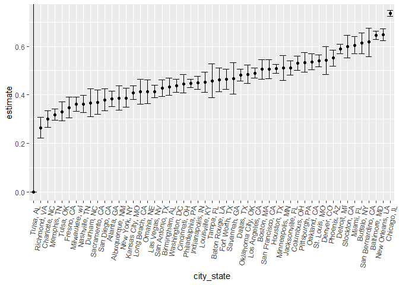

p8105\_hw5\_ks3663
================
Kee-Young Shin
November 3, 2018

``` r
library(tidyverse)
```

    ## -- Attaching packages ------------------------------------------------- tidyverse 1.2.1 --

    ## v ggplot2 3.0.0     v purrr   0.2.5
    ## v tibble  1.4.2     v dplyr   0.7.6
    ## v tidyr   0.8.1     v stringr 1.3.1
    ## v readr   1.1.1     v forcats 0.3.0

    ## -- Conflicts ---------------------------------------------------- tidyverse_conflicts() --
    ## x dplyr::filter() masks stats::filter()
    ## x dplyr::lag()    masks stats::lag()

``` r
library(purrr)
library(RCurl)
```

    ## Loading required package: bitops

    ## 
    ## Attaching package: 'RCurl'

    ## The following object is masked from 'package:tidyr':
    ## 
    ##     complete

Problem 1
---------

``` r
files_list = paste0("./data/", list.files("./data"))
files_list
```

    ##  [1] "./data/con_01.csv" "./data/con_02.csv" "./data/con_03.csv"
    ##  [4] "./data/con_04.csv" "./data/con_05.csv" "./data/con_06.csv"
    ##  [7] "./data/con_07.csv" "./data/con_08.csv" "./data/con_09.csv"
    ## [10] "./data/con_10.csv" "./data/exp_01.csv" "./data/exp_02.csv"
    ## [13] "./data/exp_03.csv" "./data/exp_04.csv" "./data/exp_05.csv"
    ## [16] "./data/exp_06.csv" "./data/exp_07.csv" "./data/exp_08.csv"
    ## [19] "./data/exp_09.csv" "./data/exp_10.csv"

``` r
output = map_df(files_list, read.csv) %>% 
  add_column(files_list, .before = "week_1") %>% 
  mutate(files_list = str_replace(files_list, "./data/", ""),
         files_list = str_replace(files_list, ".csv", "")) %>% 
  separate(files_list, into = c("Control Arm", "Subject ID"), sep = "_") %>% 
  janitor::clean_names()
output
```

    ##    control_arm subject_id week_1 week_2 week_3 week_4 week_5 week_6 week_7
    ## 1          con         01   0.20  -1.31   0.66   1.96   0.23   1.09   0.05
    ## 2          con         02   1.13  -0.88   1.07   0.17  -0.83  -0.31   1.58
    ## 3          con         03   1.77   3.11   2.22   3.26   3.31   0.89   1.88
    ## 4          con         04   1.04   3.66   1.22   2.33   1.47   2.70   1.87
    ## 5          con         05   0.47  -0.58  -0.09  -1.37  -0.32  -2.17   0.45
    ## 6          con         06   2.37   2.50   1.59  -0.16   2.08   3.07   0.78
    ## 7          con         07   0.03   1.21   1.13   0.64   0.49  -0.12  -0.07
    ## 8          con         08  -0.08   1.42   0.09   0.36   1.18  -1.16   0.33
    ## 9          con         09   0.08   1.24   1.44   0.41   0.95   2.75   0.30
    ## 10         con         10   2.14   1.15   2.52   3.44   4.26   0.97   2.73
    ## 11         exp         01   3.05   3.67   4.84   5.80   6.33   5.46   6.38
    ## 12         exp         02  -0.84   2.63   1.64   2.58   1.24   2.32   3.11
    ## 13         exp         03   2.15   2.08   1.82   2.84   3.36   3.61   3.37
    ## 14         exp         04  -0.62   2.54   3.78   2.73   4.49   5.82   6.00
    ## 15         exp         05   0.70   3.33   5.34   5.57   6.90   6.66   6.24
    ## 16         exp         06   3.73   4.08   5.40   6.41   4.87   6.09   7.66
    ## 17         exp         07   1.18   2.35   1.23   1.17   2.02   1.61   3.13
    ## 18         exp         08   1.37   1.43   1.84   3.60   3.80   4.72   4.68
    ## 19         exp         09  -0.40   1.08   2.66   2.70   2.80   2.64   3.51
    ## 20         exp         10   1.09   2.80   2.80   4.30   2.25   6.57   6.09
    ##    week_8
    ## 1    1.94
    ## 2    0.44
    ## 3    1.01
    ## 4    1.66
    ## 5    0.48
    ## 6    2.35
    ## 7    0.46
    ## 8   -0.44
    ## 9    0.03
    ## 10  -0.53
    ## 11   5.91
    ## 12   3.78
    ## 13   3.74
    ## 14   6.49
    ## 15   6.95
    ## 16   5.83
    ## 17   4.88
    ## 18   5.70
    ## 19   3.27
    ## 20   4.64

``` r
# make spaghetti plot comparing both arms 
output %>% 
  gather(key = week, value = observation, week_1:week_8) %>% 
  arrange(control_arm, subject_id) %>% 
  group_by(subject_id) %>% 
  ggplot(aes(x = week, y = observation, color = subject_id, group = subject_id)) + 
    geom_line() + 
    facet_wrap(~control_arm) + 
    theme(axis.text.x = element_text(angle = 45, hjust = 1))
```


Problem 2
---------

``` r
homicide_df = read.csv(text = getURL("https://raw.githubusercontent.com/washingtonpost/data-homicides/master/homicide-data.csv")) %>% 
  unite(city_state, city:state, sep = ", ") %>% 
  janitor::clean_names()

homicide_df_summarized = homicide_df %>% 
  group_by(city_state) %>% 
  summarize(total_homicide = n(),
      unsolved_homicide = sum(disposition == "Closed without arrest") 
      + sum(disposition == "Open/No arrest"))

homicide_df_summarized
```

    ## # A tibble: 51 x 3
    ##    city_state      total_homicide unsolved_homicide
    ##    <chr>                    <int>             <int>
    ##  1 Albuquerque, NM            378               146
    ##  2 Atlanta, GA                973               373
    ##  3 Baltimore, MD             2827              1825
    ##  4 Baton Rouge, LA            424               196
    ##  5 Birmingham, AL             800               347
    ##  6 Boston, MA                 614               310
    ##  7 Buffalo, NY                521               319
    ##  8 Charlotte, NC              687               206
    ##  9 Chicago, IL               5535              4073
    ## 10 Cincinnati, OH             694               309
    ## # ... with 41 more rows

``` r
# run prop.test for Baltimore, MD
baltimore_results = prop.test(x = homicide_df_summarized %>% filter(city_state == "Baltimore, MD") %>% pull(unsolved_homicide), n = homicide_df_summarized %>% filter(city_state == "Baltimore, MD") %>%  pull(total_homicide)) %>% 
  broom::tidy()

# pull estimated proportion and confidence interval
baltimore_results %>% 
  select(estimate, conf.low, conf.high) 
```

    ## # A tibble: 1 x 3
    ##   estimate conf.low conf.high
    ##      <dbl>    <dbl>     <dbl>
    ## 1    0.646    0.628     0.663

``` r
# run prop.test on all city-states
prop_test_output = homicide_df_summarized %>% 
  group_by(city_state) %>% 
  nest() %>% 
  mutate(output = map2(.x = homicide_df_summarized %>% pull(unsolved_homicide), 
              .y = homicide_df_summarized %>% pull(total_homicide), 
              ~prop.test(x = .x, n = .y)),
         output = map(output, broom::tidy)) %>% 
  select(-data) %>% 
  unnest() %>% 
  select(c("city_state", "estimate", "conf.low", "conf.high"))
```

    ## Warning in prop.test(x = .x, n = .y): Chi-squared approximation may be
    ## incorrect

``` r
# create plot showing estimate for all city-states and their Confidence Intervals
prop_test_output %>% 
  mutate(city_state = as.factor(city_state),
         city_state = fct_reorder(city_state, estimate)) %>% 
  ggplot(aes(x = city_state, y = estimate)) + 
    geom_point() +
    geom_errorbar(ymin = prop_test_output$conf.low, 
                  ymax = prop_test_output$conf.high) +
    theme(axis.text.x = element_text(angle = 80, hjust = 1))
```


